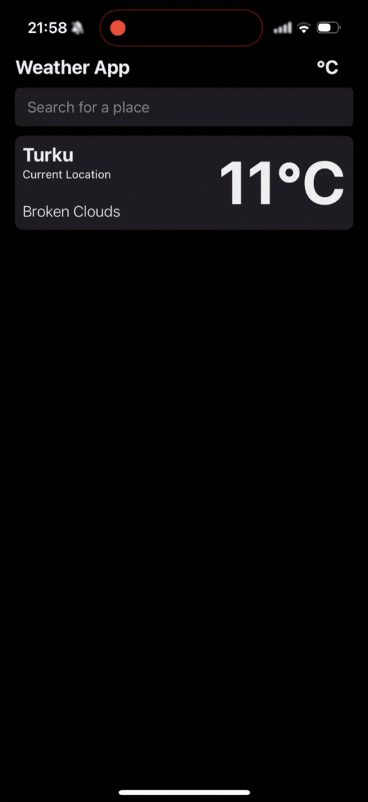

# 🌦️ Weather Forecast App

A modern weather app built with **Expo**, **React Native**, and **TypeScript**, featuring real-time weather, a 5-day forecast, location search with autocomplete, and geolocation support. Designed with scalability and developer experience in mind.

## ✨ Features

### 🔍 Location Search

- Search for weather by city or location
- **Autocomplete** with `react-native-autocomplete-dropdown`
- **Recent searches**
- **Mocked Places API** for autocomplete (Google Places would be used in production)

### 🌤️ Current Weather

- Temperature, feels-like
- Humidity & wind speed
- Weather condition icons

### 📅 5-Day Forecast

- Daily forecast cards with:
  - Min/Max temperatures
  - Weather conditions

### 📍 Geolocation

- Detect user’s current location
- Manual override option

### 🌓 Theming & UX

- Fully compatible with **light & dark mode**
- Responsive design across devices
- Internationalization support with **i18n** – future-proof for multiple languages

## ⚙️ Tech Stack

- **Expo** – chosen for optimal React Native dev experience
- **TypeScript** – safety and clarity
- **TanStack Query** – for managing API state (preferred over Redux for simplicity)
- **Redux** – minimally used, per assignment requirement
- **React Navigation** – screen management
- **OpenWeatherMap API** – weather data
- **i18next** – translations and future localization support
- **React Native Autocomplete Dropdown** – flexible, debounced autocomplete with highlight features

## 📁 Project Structure

```
.
├── api/                  # API client and TanStack Query logic
├── app/                  # Routes and screens (expo-router)
├── assets/               # Fonts, images, static files
├── components/           # Reusable UI components
├── constants/            # App-wide constants
├── hooks/                # Custom React hooks
├── i18n/                 # Translation config
├── store/                # Redux store and slices
├── translations/         # i18n translation files
├── types/                # TypeScript types
├── utils/                # Utility functions
```

## 🚀 Getting Started

1. **Clone the repo**

   ```bash
   git clone https://github.com/freddybreitenstein/weather-app.git
   cd weather-app
   ```

2. **Install dependencies (with Bun)**

   ```bash
   bun install
   ```

3. **Start the app**

   ```bash
   npx expo start
   ```

   Open the app using:

   - Android Emulator
   - iOS Simulator
   - Physical device with **Expo Go**

4. **Run tests**

   ```bash
   npm test
   ```

## 📌 Architecture Notes

- Chose **TanStack Query** for data fetching and caching instead of Redux due to its simplicity and power.
- **Redux (plain JavaScript)** is integrated as per requirement but used minimally.
- Used a **mock Places API** for faster development; would integrate Google Places in production.
- **i18n setup** is ready to scale the app for multilingual support.
- Expo was selected for its excellent tooling, updates, and development workflow.

## 🧪 Testing

- Unit tests written using **Jest**

## 🔮 Future Improvements

If given more time, I would:

- Implement **end-to-end (E2E) testing** using Detox or Playwright
- Add **unit tests** using Jest & React Native Testing Library
- Build a **robust design system** using tools like **React Native Unistyles**
- Improve accessibility and localization completeness
- Integrate **Google Places API**

## 📸 Demo


